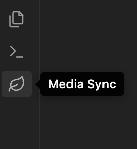
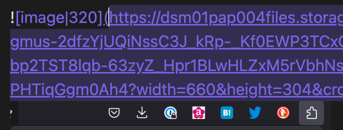
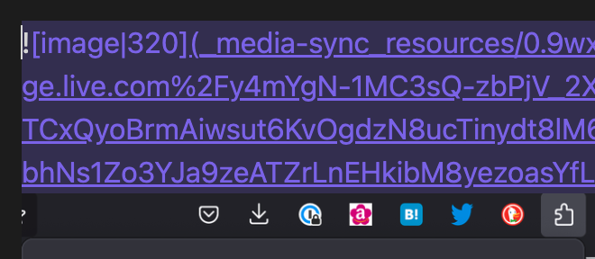
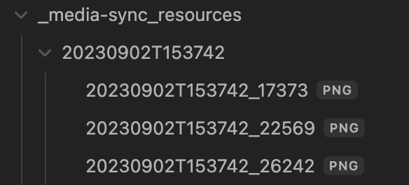
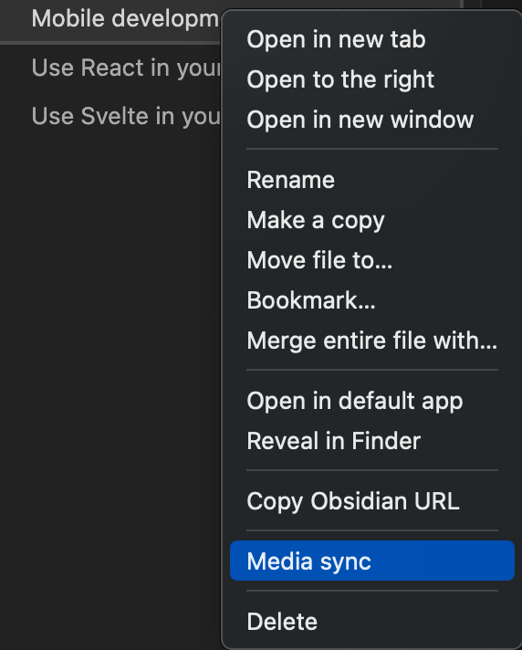

# Media Sync

`Media Sync` is a plugin for [Obsidian](https://obsidian.md) that allows you to downloads media files(eg. images, PDFs) from the URLs in Obsidian documents and displays the content.

## How to use

Click the `Media sync` icon in the left sidebar.

Then, the plugin will start downloading media files from the URLs in the documents.

Once an media file has been downloaded, the Markdown file will not be processed the next time.

The following media files with URLs starting with https.

The media file is downloaded locally and the Markdown link is updated.

A directory named `_media-sync_resouces` is created and the media files are downloaded into that directory paths can be changed in the configuration.

Right-click on the file and click Media sync to download the media files for the target note only.

When executed from the leaf icon, notes are cached and the media download process is skipped once the notes are executed, but right-click execution always downloads the media files.

